### Taller Nivel 1 
## Estudio de los patrones ecológicos y de divergencia genética de especies marinas en México
### Seminario: Aplicaciones en sistemática y filogenia

#### Semestre: 2026-1
#### Duración: 2 hrs
#### Por: Dr. Vicente J. Castillo Chora

**¿Qué es un seminario?**  \
Un seminario es una reunión académica, técnica o profesional para el estudio profundo de un tema específico a través de la interacción, el debate y la participación activa.

**Diversidad**

Hay múltiples enfoques para estudiar la diversidad:
 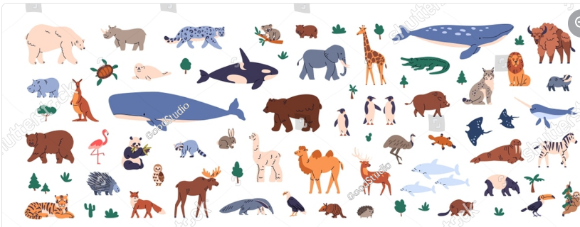

Morfológico

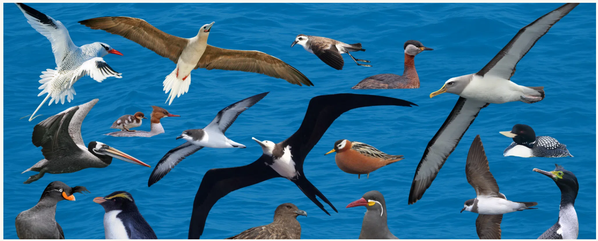

Fisiológico 

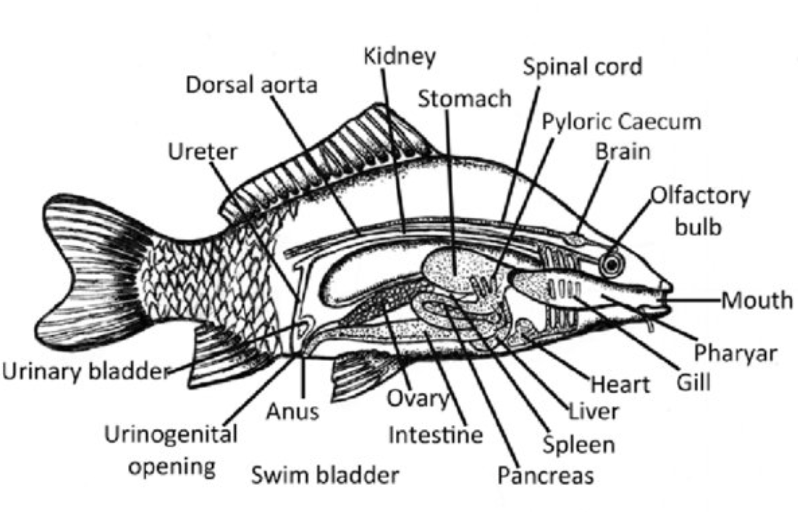

Ecológico 

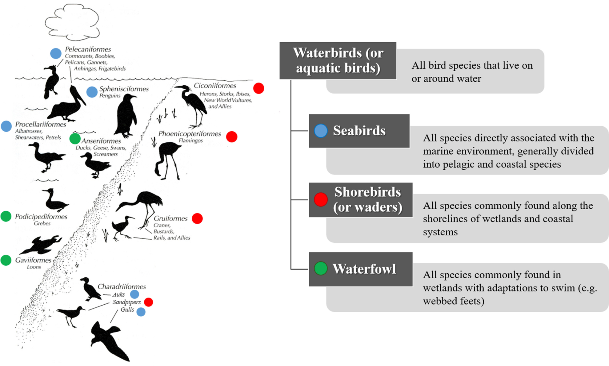

Genético / genómico 

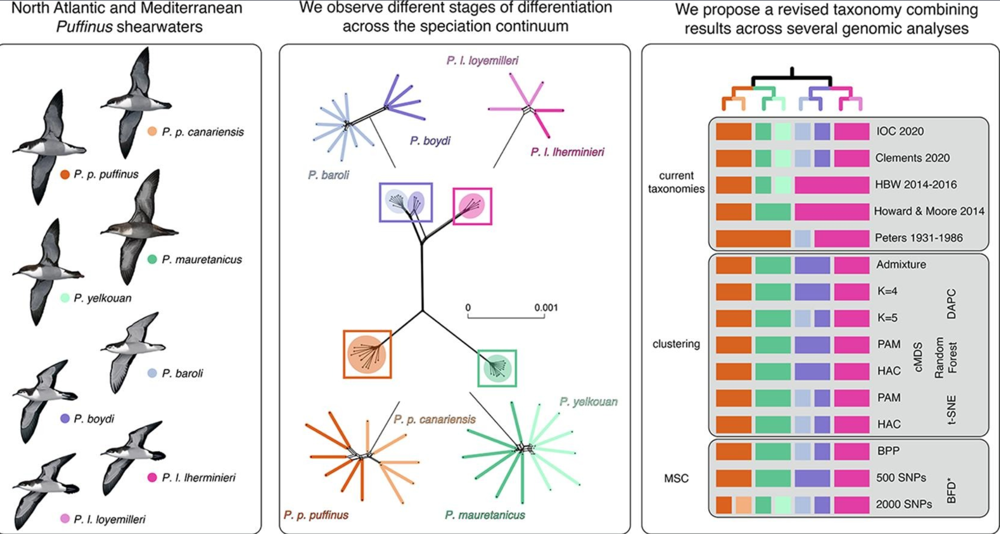

**Sistemática** \
Es la ciencia que estudia la diversidad biológica. Trata de entender las relaciones genealógicas de las especies vivas y extintas y de interpretar la manera en que la vida se ha diversificado y cambiado a través del tiempo [(Goyenechea et al 2009)](https://www.uaeh.edu.mx/investigacion/icbi/LI_SistBioAnimal/Irene_Mayer/G2009SistematicaHerreriana.pdf). 

Engeneral, intenta crear un orden dentro de la gran diversidad biológica, a través de dos objetivos fundamentales: 

**Clasificar a los organismos** 
- Taxonomía: Nombrar y describir las especies.

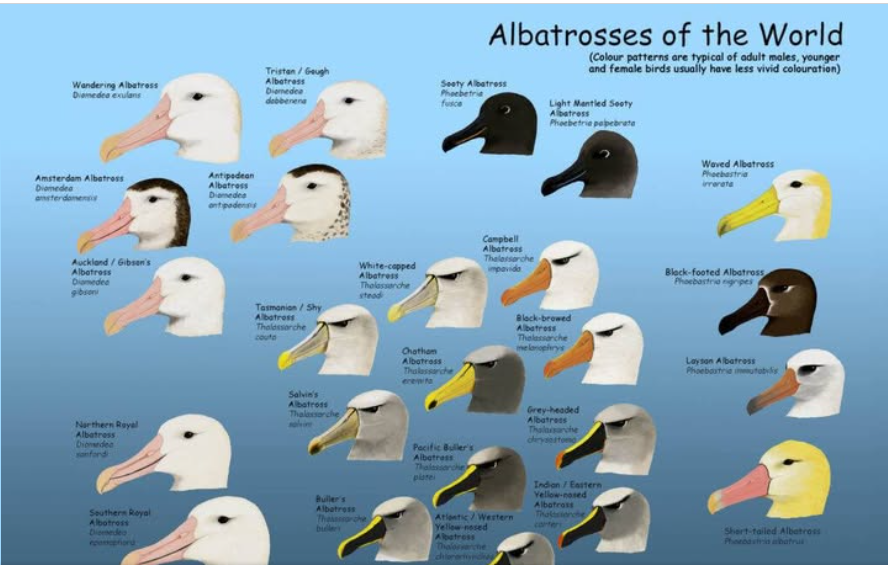

- Filogenia: Identificar relaciones evolutivas. 

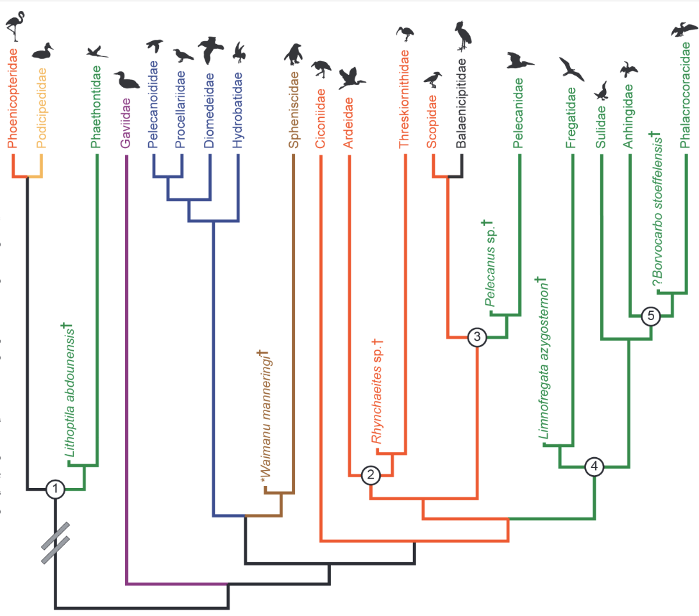

**¿Por qué tantos enfoques?** \
**Algunas consideraciones:** 
- Identificación inexacta 
- Carácteres con más peso 
- Muestreo incompleto de linages (extinción)
- Variación críptica
- Proceso de especiación es continuo 

**¿Qué es una filogenia?**

Hipótesis de las relaciones de parentezco a nivel de especies y que nos permite hacer inferencias sobre los procesos evolutivos a partir de las especies existentes (y fósiles). 

**Sistemática molecular**

- Con el uso de filogenia moleculares, no eliminamos estas fuentes de error, pero al menos las podemos reducir y cuantificar. 
- Se ha observado que tienden a resolver relaciones complejas, ya sea muy recientes o profundas. 
- Recuperan los patrones obtenidos por otros métodos. 
- **Una filogenía molecular nos permite incorporar la noción de tiempo.**

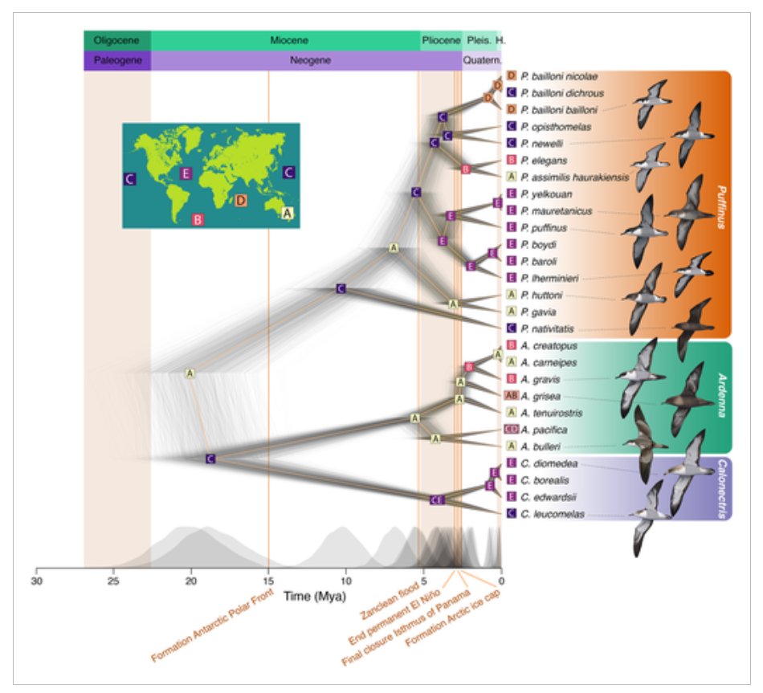

**¿Es importante la información temporal que nos da una filogenia molecular?**

-Sí

**¿Por qué?**

-Las filogenias moleculares nos permiten formular preguntas e hipótesis evolutivas.

- Tasas de especiación y extinción en diferentes linages. 

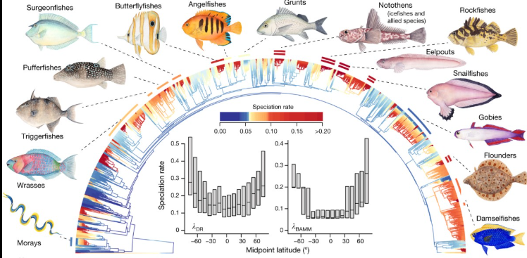

[An inverse latitudinal gradient in speciation rate for marine fishes](https://www.nature.com/articles/s41586-018-0273-1)

- Probar hipótesis biogeográficas (e.g., el efecto de una barrera en la diversificación).

**Distribución de pardelas**
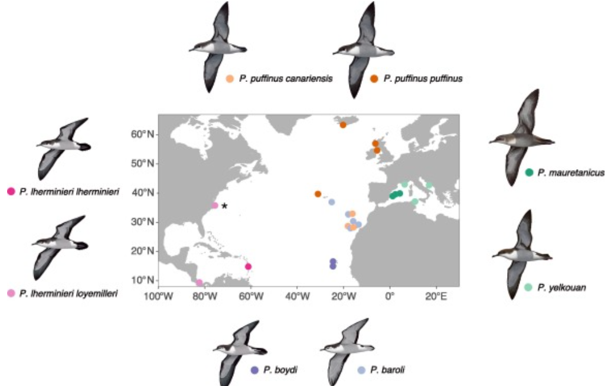

**Relación a nivel de Islas**
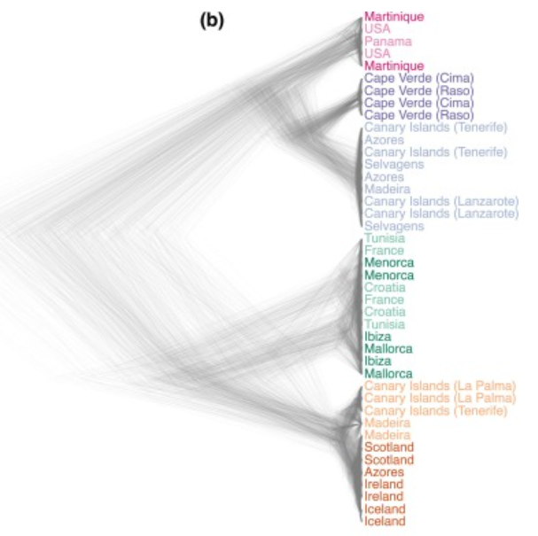

[Species delimitation using genomic data to resolve taxonomic uncertainties in a speciation continuum of pelagic seabirds](https://www.sciencedirect.com/science/article/pii/S1055790322002846)

- Reconstruir estados ancestrales. 

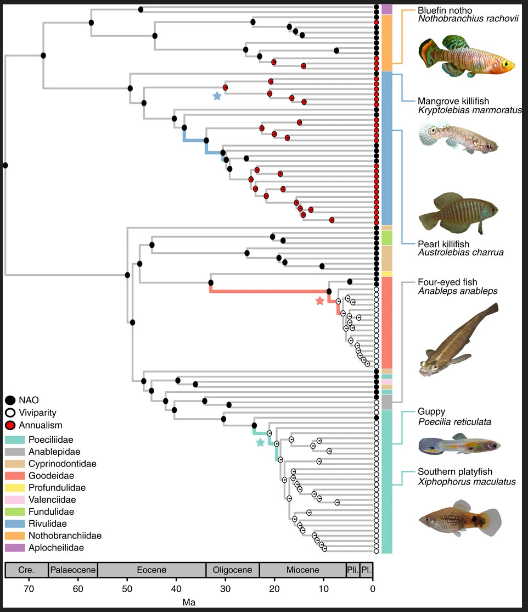

[Viviparity stimulates diversification in an order of fish](https://www.nature.com/articles/ncomms11271)

- Para analizar si un carácter se asocia con mayores tasas de diversificación.

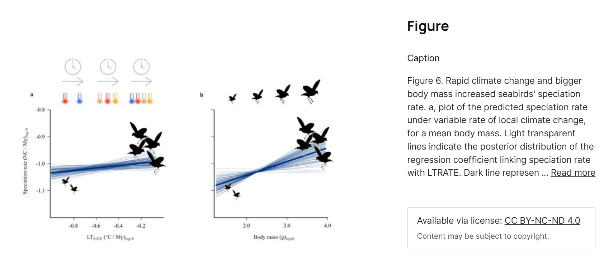

[Seabird range contraction and dispersal under climate change](https://www.researchgate.net/publication/392394519_Seabird_range_contraction_and_dispersal_under_climate_change)

- Estimar las tasas de cambio de un estado de caracter.

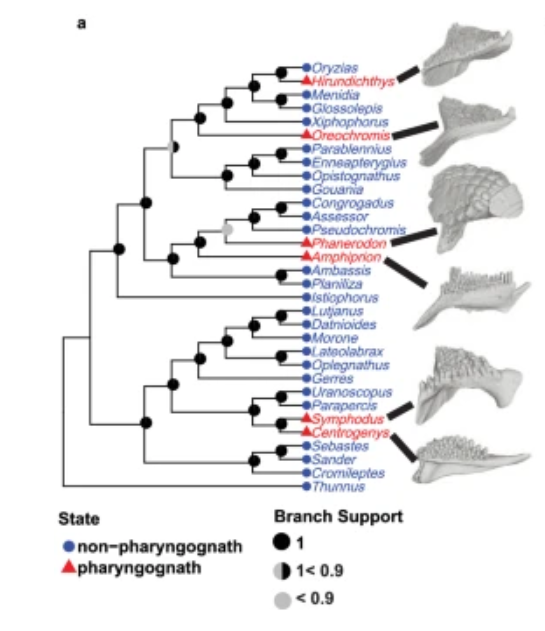

[The macroevolutionary dynamics of pharyngognathy in fishes fail to support the key innovation hypothesis](https://www.nature.com/articles/s41467-024-53141-4)

- Probar hipótesis de coevolución. 

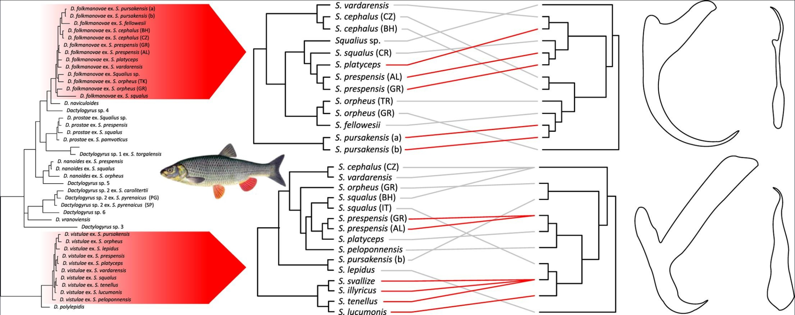

### Discusión
¿Cómo se puede integrar la sistemática molecular en sus proyectos y/o tesis?

### Recomendaciones:

**Cursos** \
Sistemática molecular \
Genética poblaciones \
Biogeografía 2

**Otras fuentes**\
GitHub\
Manuales\
Artículos científicos \
Comunicación personal 